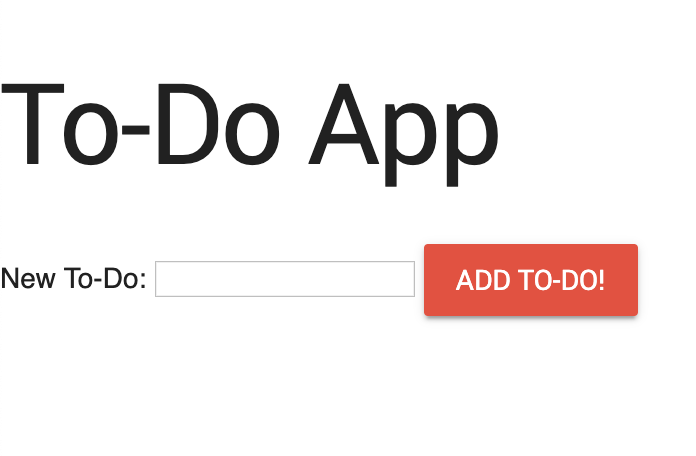

# To Do App
The To Do App project was to designed to show how JavaScript methods are triggered by designing a to-do-list like webpage
to create a list of items and to also enable a function to delete certains items as well.

## To Do List Format

