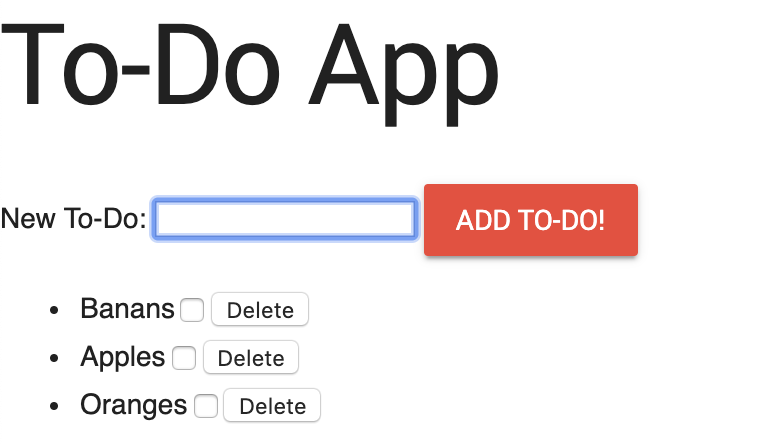
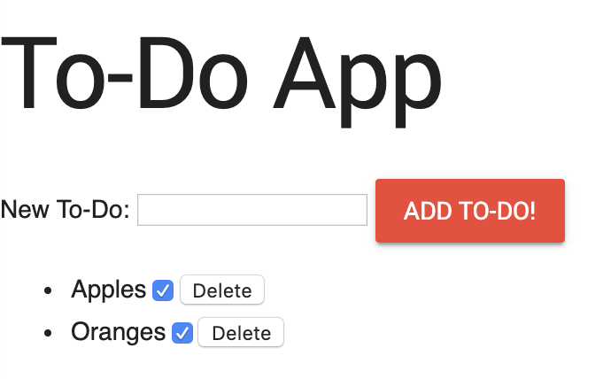

# To Do App
The To Do App project was to designed to show how JavaScript methods are triggered by designing a to-do-list like webpage
to create a list of items and to also enable a function to delete certains items as well.

## To Do List Format

**This is the format of the list I made adding an orange color and Roboto font**

## Adding items to the list

**Simply type in the items you want to add and click on ADD-TO-DO! once finished. Add as many items as you like.**

## Ability to delete items with checkboxes

**You have the ability to delete items by checking the appropiate checkbox first and then hitting the Delete button**

